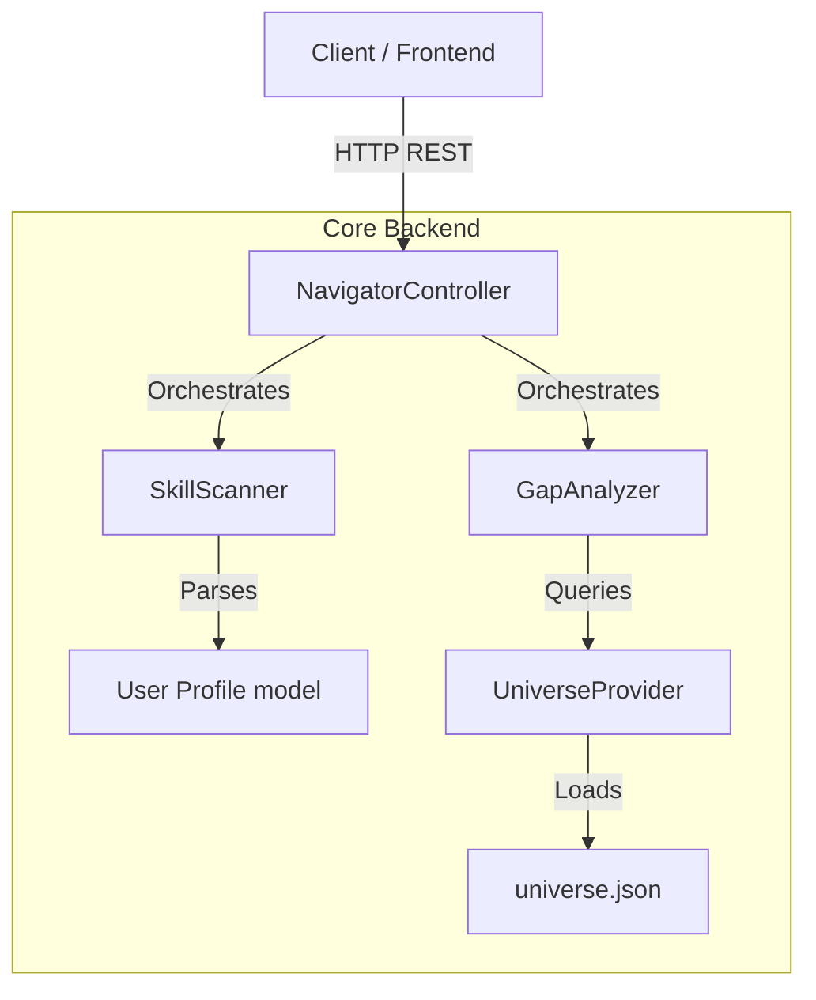

# CareerNavigator Core Documentation {#mainpage}

## 🚀 Overview

The **CareerNavigator Core** is a high-performance ASP.NET Core Web API that serves as the intelligence engine for the platform. It bridges the gap between raw semantic data (provided by the DataFactory) and user-facing features.

Key Responsibilities:
- **Skill Gap Analysis**: Comparing user profiles against job descriptions.
- **Smart Pathfinding**: Recommending "Bridge Skills" to efficiently transition between roles.
- **Seniority Assessment**: Evaluating user experience levels based on skill proficiency and tenure.

---

## 🏗 Architecture

The Core is built on a clean, service-oriented architecture:

## 🧩 Key Components

### 1. Controllers
- **NavigatorController**: The main entry point. Exposes endpoints for identifying gaps (`/analyze`) and retrieving skill graph data.

### 2. Engines
- **SkillScanner**: A regex-based engine that extracts skills from raw text (resumes/inputs) and determines the user's implicit seniority.
- **GapAnalyzer**: Performs the diffing logic. It uses Graph Theory (BFS/Dijkstra via the `Universe`) to find the shortest path of skill acquisition.
- **UniverseProvider**: A Singleton service that holds the `DataFactory`-generated knowledge graph in memory for O(1) lookups.

### 3. Models
- **Universe**: The in-memory graph representation (Nodes & Adjacency List).
- **AnalysisRequest**: The DTO for user input.
- **AnalysisResult**: The DTO for the analysis response.

---

## 🛠 Dependencies

- **.NET 8.0**: High-performance runtime.
- **Newtonsoft.Json**: For parsing the massive `universe.json` artifact.
- **Microsoft.Extensions.Logging**: Structured logging.

